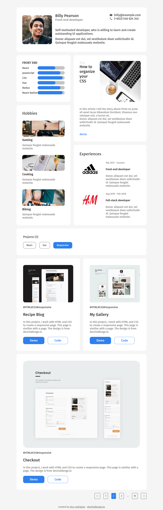
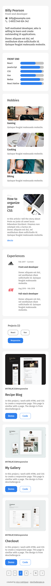

<h1 align="center">Portfolio</h1>

   Solution for a challenge from  <a href="http://devchallenges.io" target="_blank">Devchallenges.io</a>.

  <h3>
    <a href="https://portfolio-e73685.netlify.app/">
      Solution
    </a>
     | 
    <a href="https://devchallenges.io/challenges/5ZnOYsSXM24JWnCsNFlt">
      Challenge
    </a>
  </h3>

## Overview

Visit [<https://portfolio-e73685.netlify.app/>](https://portfolio-e73685.netlify.app/).

Desktop

Mobile

## Features

This application/site was created as a submission to a [DevChallenges](https://devchallenges.io/challenges) challenge. The [challenge](https://devchallenges.io/challenges/5ZnOYsSXM24JWnCsNFlt) was to build an application to complete the given user stories.

It uses `flex-wrap` and `flex-grow` for making the components responsive and stack over each other on mobile.
